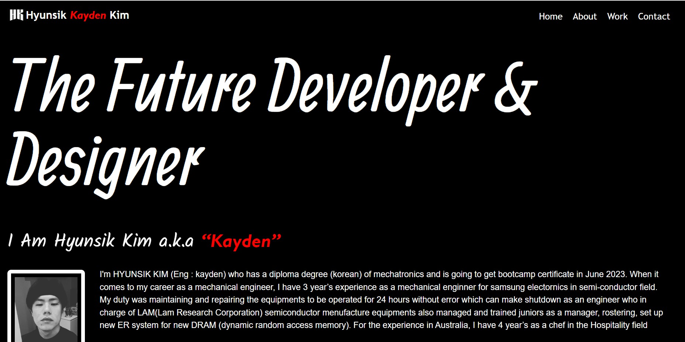
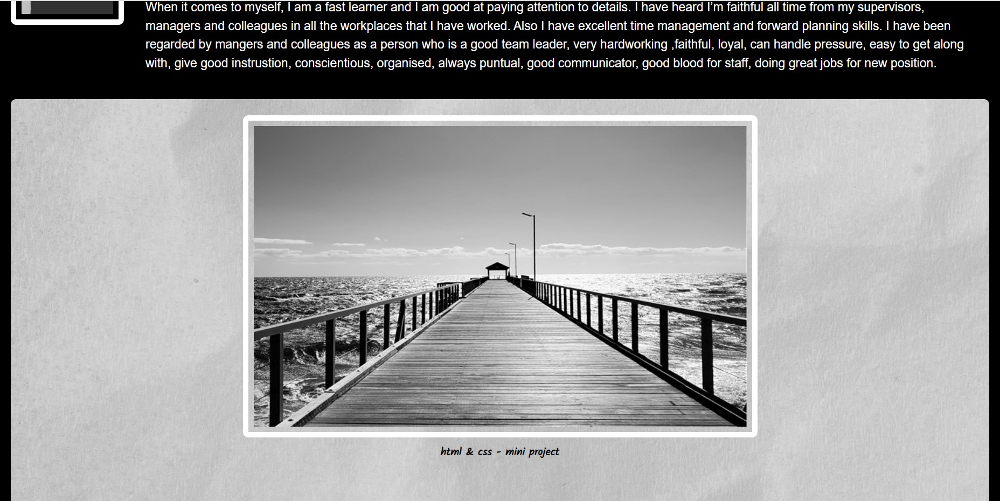

# hyunsik kayden kim-portfolio

## Description

This Professional portfolio was created to showcase your skills and talents to employers looking to fill a part-time or full-time position. It contains notes on HTML, CSS.

I create a web application from scratch and designed the web application to make have the best accessibility and easy to read.
Also I put some functions to navigation and contact for vistior to reach the sections easily.

I learned how to create a web application from scratch by doing wireframing, refering lots of properties to make the design that I want.
Also I learned how to goole the way that I want to refer or apply to my code to reach the goal that I want.

## Installation

N/A

## Usage

To understand the code that I code, please read the comments in CSS file. 
To read my portfolio easily, click each item in navigation bar. Once you click, THEN the UI scrolls to the corresponding section. 

Also when you click the each contact, it will show you messages for phone number and email address and corresponding webpages of contack for Github, Facebook and Instagram.
 

URL = https://kayden-hyunsikkim.github.io/hyunsik-kayden-kim-portfolio/

(screenshot image could be slitely different with the web application)

## Credits

N/A

## License

N/A
